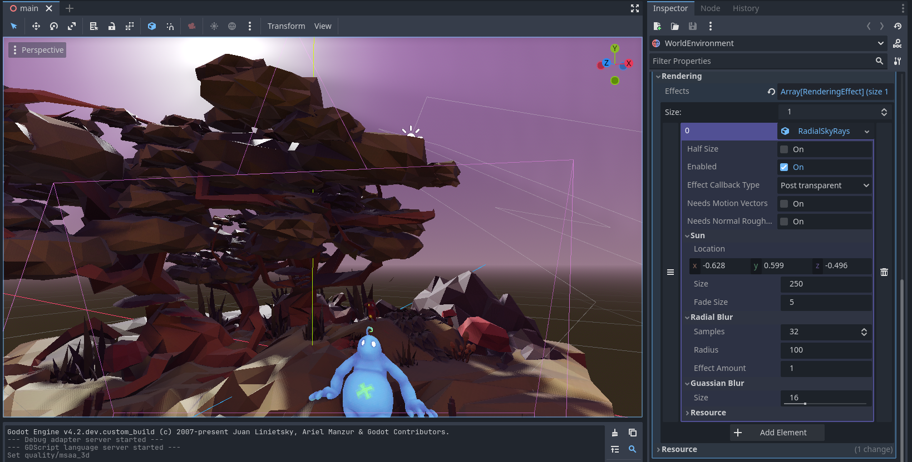

# Radial blur based sky rays Rendering Effect

This repository contains a Godot test project that implements a blur based lighting post effect based on the approach defined in this tweet from Harry Alisavakis:
https://twitter.com/HarryAlisavakis/status/1405807665608015872?s=20

It uses the new Rendering Effects API, you'll need to compile Godot with this PR included: 
https://github.com/godotengine/godot/pull/80214

Note that this project was build as a straight forward implementation of this effect. The blur shaders can definately be optimised a lot, they do not make use of more advanced abilities of compute shaders.
The goal was to produce an example to showcase how Rendering Effects can be implemented.

## License

The source in this repository falls under an MIT license (see LICENSE)

The 3D scene used is licensed CC-BY-04 - Klonk games (see assets/sketchfab/shift_happens/license.txt)
